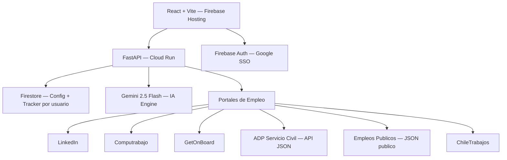

# Job Hunter v5 — Plataforma SaaS de Busqueda Inteligente de Empleo

  

  
  
  
  
  
  
  

---

## Descripcion General

**Job Hunter v5** es una plataforma SaaS multi-usuario de busqueda automatizada de empleo con inteligencia artificial integrada. Desplegada completamente en Google Cloud Platform, permite a los usuarios cargar su curriculum, buscar vacantes en multiples portales de empleo simultaneamente, evaluar su nivel de encaje con cada oferta y adaptar su CV de forma personalizada para cada postulacion.

La arquitectura evoluciona desde versiones anteriores (v3 desktop, v4 local) hacia un modelo cloud-native con autenticacion por usuario, configuracion persistente en Firestore y despliegue continuo en Cloud Run.

---

## Arquitectura del Sistema

---

## Modulos Core

### 1. Gestion de CV e Extraccion de Keywords

El usuario carga su CV en formato PDF, DOCX o TXT. Gemini extrae automaticamente las palabras clave profesionales relevantes y genera un conjunto de filtros negativos (Escudo Anti-Basura) para excluir ofertas irrelevantes desde el primer momento.

  

### 2. Buscador Multi-Portal con Escudo Anti-Basura Semantico

El buscador ejecuta consultas en paralelo sobre 6 portales de empleo activos. Cada portal utiliza el metodo de extraccion mas eficiente disponible: scraping HTML, API JSON oficial o endpoint publico. Una vez recolectadas las ofertas, un filtro semantico basado en Gemini evalua la lista completa de titulos en una sola llamada, eliminando ofertas de areas completamente distintas al perfil del candidato antes de presentarlas al usuario.

  

Caracteristicas del buscador:

- Busqueda simultanea en LinkedIn, Computrabajo, GetOnBoard, ADP Servicio Civil, Empleos Publicos y ChileTrabajos
- Filtro semantico batch con Gemini: una sola llamada evalua cientos de titulos contra el perfil del candidato
- Escudo Anti-Basura: combinacion de blacklist por keywords negativas + filtrado semantico por area profesional
- Deduplicacion automatica de ofertas repetidas entre portales

### 3. Vacantes y Adaptador Curricular con Smart Scorer por Portal

Las vacantes se presentan agrupadas por portal. Cada seccion tiene su propio boton de scoring independiente, permitiendo al usuario priorizar y evaluar portales de forma selectiva sin esperar la evaluacion completa de todas las ofertas.

  

Caracteristicas del modulo de vacantes:

- Scorer independiente por portal: evaluacion selectiva sin bloquear el resto de la interfaz
- Fit Score 0-100 por oferta con razones de encaje y brechas identificadas
- Filtro dinamico por umbral de fit score dentro de cada portal
- Adaptacion de CV con Gemini para cada oferta especifica aplicando formula X-Y-Z
- Generacion de PDF del CV adaptado con ReportLab
- Tracker de postulaciones guardado en Firestore por usuario

### 4. Pipeline de Inteligencia Artificial

Todos los modulos de IA utilizan Gemini 2.5 Flash como motor principal, con configuracion de `thinkingBudget: 0` para tareas estructuradas JSON, evitando latencia innecesaria de razonamiento interno.

Funciones IA implementadas:

- Extraccion de keywords profesionales desde CV
- Generacion de filtros negativos contextuales
- Filtrado semantico batch de titulos de ofertas
- Scoring de encaje CV vs oferta (score + razones + brechas)
- Adaptacion de CV personalizada por vacante
- Resumen del perfil del cargo requerido
- Generacion de CV estructurado en JSON para PDF de alta calidad

---

## Stack Tecnologico

| Capa | Tecnologia |
|---|---|
| Frontend | React 18 + Vite, diseño dark mode personalizado |
| Backend | FastAPI (Python 3.12), desplegado en Google Cloud Run |
| Autenticacion | Firebase Authentication (Google SSO), whitelist de usuarios |
| Base de datos | Cloud Firestore (configuracion + tracker de postulaciones por usuario) |
| Hosting | Firebase Hosting (frontend), Cloud Run (backend) |
| IA | Gemini 2.5 Flash via Google Generative Language API |
| PDF | ReportLab (generacion dinamica de CV adaptados) |
| Portales | LinkedIn, Computrabajo, GetOnBoard, ADP Servicio Civil, Empleos Publicos, ChileTrabajos |

---

## Estado de Licenciamiento

> [!IMPORTANT]
> **SOFTWARE PROPIETARIO — CODIGO CERRADO (Closed-Source Commercial Software)**
>
> Este repositorio contiene unicamente la presentacion de arquitectura, documentacion y capturas de pantalla del sistema Job Hunter v5 para propositos de portafolio profesional. El codigo fuente de produccion se encuentra en infraestructura privada y es distribuido bajo licencia comercial.
>
> Para consultas comerciales o demostraciones del software, puedes contactar al propietario de esta cuenta de GitHub.
